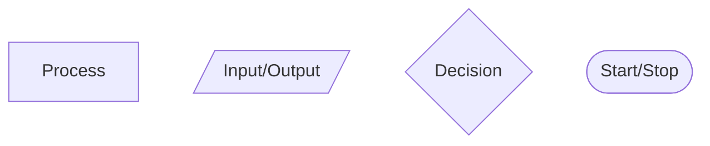
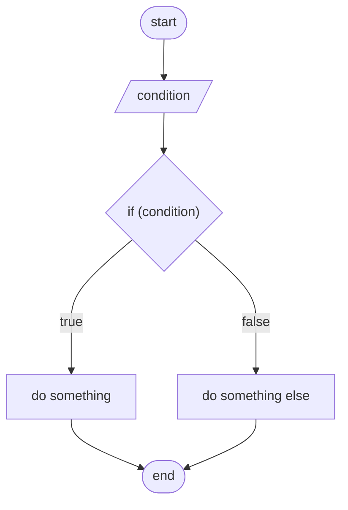

CI411 - Introduction to Game Programming 2024 -25
Module Leader: Steven Kilgallon
Name: Roni Luffman
Student ID: 24824484

# Workshop Logs
## Week 1
#### Topics and Themes
- Basic arithmetic operators (+, -, \*,  /, %)
- String literals and printing to the console
- Assigning console input to variables
- Basic data types (string, int, float)
- Arithmetic operations on variables
#### Source Code
```cpp
#include <iostream>
using namespace std;

int main() {
    cout << "//=======================//\n";
    cout << "   Arithmetic operators:   \n\n";

    // Addition
    cout << "7 + 3 = " << 7 + 3 << endl;
    // Subtraction
    cout << "7 - 3 = " << 7 - 3 << endl;
    // Multiplication
    cout << "7 * 3 = " << 7 / 3 << endl;
    // Integer Division
    cout << "7 / 3 = " << 7 / 3 << endl;
    // Float Division
    cout << "7.0 / 3.0 = " << 7.0 + 3.0 << endl;
    // Modulo Operator
    cout << "7 % 3 = " << 7 % 3 << endl;

    // Order of operations:
    cout << " 7 + 3  * 5 = " <<  7 + 3  * 5 << endl;
    cout << "(7 + 3) * 5 = " << (7 + 3) * 5 << endl;

    cout << "\n     We're done here...    \n";
    cout <<   "//=======================//\n";

    //=============================//

    cout << "\n//=======================//\n";
    cout <<   "   Variables and Input:    \n\n";

    const float PI = 3.14159;

    cout << "Enter a number:\n";
    cout << "> ";
    float radius;
    cin >> radius;
    cout << endl;

    cout << "Radius = " << radius << endl;
    float circumference = 2.0 * PI * radius;
    cout << "Circumference = " << circumference << endl;
    float area = PI * radius * radius;
    cout << "Area = " << area << "\n\n";

    //=============================//
    
    cout << "Continued...\n\n";
    
    cout << "Enter a speed (m/s)\n";
    cout << "> ";
    float speed;
    cin >> speed;

    cout << "Enter a distance (m)\n";
    cout << "> ";
    float distance;
    cin >> distance;

    float time_taken = distance / speed;
    cout << "At " << speed << "m/s " 
    << distance << "m is traversed in " 
    << time_taken << "s\n";

    //=============================//
    
    cout << "Continued...\n\n";
    
    cout << "How healthy are you? (0~100)\n";
    cout << "> ";
    float health;
    cin >> health;
    
    cout << "How robust are you? (0~100)\n";
    cout << "> ";
    float defence;
    cin >> defence;

    cout << "How hard would you like to be hit?\n";
    cout << "> ";
    float attack;
    cin >> attack;

    float damage = attack * (100.0 - defence) / 100.0;
    health -= damage;

    cout << "\nOuch...\n";
    cout << "Your health is now " << health << endl;

    cout << "\n     We're done here...    \n";
    cout << "//=======================//\n";
    
    return 0;
}
```

#### Terminal Output
![[week1a.png]]
![[week1b.png]]
#### Discussion of workshop activity
In this workshop, we covered the basics of the C++ coding language (listed in the topics and themes above). Which are, I think, almost identical in the two other languages I'm familiar with (Rust and C#). And since they are already so ingrained in my understanding, its difficult to describe them in more depth than just saying 'these are the axiomatic building blocks of all coding languages, and we all just *know* them'.

What *is* new to me are the stream extraction and insertion operators - which I find unintuitive. I understand how to use them, to print to the console and assign console input to a variable, but they feel to me like a quirk of C++ that hasn't been adopted by modern languages. A quick google search shows that there are other uses for these operators, which should justify their existence, but I think I need to have an in-person discussion to understand them fully.
#### Reading
Arithmetic operators are symbols which are written between two operands (literals, variables, or expressions), to form an expression. An expression, by itself, is like a mathematical equation without an 'equals part'. The 'equals part' is done either during compilation or at runtime, where an expression is 'run' and evaluated to a value. If a variable and the assignment operator ("=") are written before the expression, the value is then assigned to that variable.

Each arithmetic operator represents a particular mathematical function

| Operator | Meaning        |
| -------- | -------------- |
| +        | Addition       |
| -        | Subtraction    |
| \*       | Multiplication |
| /        | Division       |
| %        | Modulo         |
Compound expressions, where more than operator is used are evaluated according to the the precedence of the operators used. A table of these precedence's can be found here: https://en.cppreference.com/w/cpp/language/operator_precedence. Operators with a greater precedence are evaluated before those with a lesser precedence.

Brackets can be used to override this precedence. Anything inside brackets will be evaluated before anything operating on those brackets. for example:
```cpp
2 * (3 + 4)
// contents brackets evaluated first =>
2 * (7)
```
#### Further work
I have since found this comment on a reddit post about the stream operators that somewhat answers my questions: https://www.reddit.com/r/cpp/comments/xbn04o/comment/io0j9ua/?utm_source=share&utm_medium=mweb3x&utm_name=mweb3xcss&utm_term=1&utm_content=share_button

I don't think I could summarise the comment better than its first sentence does:
"Streams and stream operators are type-safe, can be chained and can easily be overloaded for program defined types. Notably streams have the additional advantage of unifying output for a type into as single function."

What interests me most in their explanation is this sentence:
"IMO its something that simply wasn't possible or as obvious early on in the languages development where maybe the novelty and elegance of the "stream pattern" where overvalued."

C++ has received many updates over the years, so I find it interesting that a (subjectively) sup-optimal feature as this has only been supplemented by better alternatives (e.g. std::format and std::print) rather than being replaced entirely. I think I don't yet know enough about the language, or its maintenance, to resolve this for myself. Perhaps it's for backwards compatibility?

In conclusion, C++ is a strange new beast and, though I'm sure I'll struggle, I'm excited to learn and make use of it, especially since it's a standard of the game industry. But I also hold out hope that a more modern language like Rust (which felt easier to learn, and is purported to achieve a similar performance) will one day become the new standard.

---
## Week 2
#### Topics and Themes
- Conditional statements and control flow
- Boolean operators
#### Source Code
```cpp
#include <iostream>
#include <limits>
using namespace std;

void circle() {
	cout << "Inside the room there is a circle\n";
	
	float radius;
	cout << "What is its radius?\n"
		 << "> ";
	cin >> radius;
	cout << endl;

	float pi = 3.14159f;

	float circumference = 2.0f * pi * radius;
	cout << "Therefore, its circumference = " << circumference << endl;

	float area = pi * radius * radius;
	cout << "And, its area = " << area << "\n\n";
}

void missile() {
	cout << "Behind this door is a missile.\n";
	
	float speed;
	cout << "How fast is it? (m/s)\n"
		 << "> ";
	cin >> speed;
	cout << endl;

	float distance;
	cout << "How far must it travel to achieve enlightenment? (m)\n"
		 << "> ";
	cin >> distance;
	cout << endl;

	float time_taken = distance / speed;
	cout << "Therfore, enlightenment may be wrought in " << time_taken << " seconds.";
}

void hurt() {
	cout << "Behind this door is the life you left behind\n\n";
	
	float health;
	cout << "How healthy were you? (0~100)\n"
		 << "> ";
	cin >> health;
	cout << endl;

	float defence;
	cout << "How robust were you? (0~100)\n"
		 << "> ";
	cin >> defence;
	cout << endl;

	float attack;
	cout << "How much pain have you suffered?\n"
		 << "> ";
	cin >> attack;
	cout << endl;

	float damage = attack * (100.0f - defence) / 100.0f;
	health -= damage;

	if (health > 0.0f) {
		// the player is still alive. How nice!
		cout << "You do not belong here";
	} else {
		cout << "That is not dead which can eternal lie\n and, with strange aeons, even death may die\n";
	}
}

void escape() {
	cout << "Behind this door is the timeless void at the heart of this world.\n"
		<< "You step through,\n"
		<< "free... at last.";
}

int main() {
	cout << "//=======================//\n";
	cout << "  Conditional Statements:   \n\n";

	int x = 20, y = 20;

	if (x == y) {
		cout << "x is equal to y" << endl;
	} else {
		cout << "x is not equal to y" << endl;
	}

	if (x > y) {
		cout << "x is greater than y" << endl;
	} else if (x < y) {
		cout << "x is less than y" << endl;
	} else {
		cout << "x must be equal to y!" << endl;
	}

	cout << "\n     We're done here...    \n";
	cout << "//=======================//\n";

	system("cls");

	cout << "\n//=======================//\n";
	cout <<	  "          Task 2:          \n\n";

	cout << "You are alone in a small room.\n"
		<< "There are four doors, one on each wall.\n";
		
	
	int door;
	cout << "Which door do you choose?\n"
		 << "\n"
		 << "1. North\n"
		 << "2. East\n"
		 << "3. South\n"
		 << "4. West\n\n"
		 << "> ";
	cin >> door;
	cout << "\n";

	switch (door) {
		case 1: {
			circle();
			break;
		}
		case 2: {
			missile();
			break;
		}
		case 3: {
			hurt();
			break;
		}
		case 4: {
			escape();
			break;
		}
		default: {
			cout << "That is not an option.\n"
				<< "You cry.\n";
			break;
		}
	}

	system("cls");

	cout << "\n\n//=======================//\n";
	cout <<     "         Task 3:           \n\n";

	// introduction
	cout << "Please select a charcter to play as:\n\n";

	cout << "1. Barbarbara.\n";
	cout << "2. snazzrazz-mazzledazz.\n";
	cout << "3. The Inevitable Onslaught of Time. \n\n";
	cout << "> ";

	// character variables
	string name;
	string weapon;
	float heavy_attack_dmg;
	string heavy_reaction;
	float light_attack_dmg;
	string light_reaction;
	float swiftness;

	// charcter pick
	int pick;
	cin >> pick;

	switch (pick) {
		case 1:
			name = "Barbarbara";
			weapon = "Vogon poetry";
			heavy_attack_dmg = 100.0f;
			heavy_reaction = "Barbarbara begins reciting her poetry (She wrote it herself, you know).\nShia Labeouf stops and listens.\nIt reminds him of \'Transformers: Revenge of The Fallen\'.";
			light_attack_dmg = 90.0f;
			// ^Even when spoken quickly, vogon poetry is still quite bad
			light_reaction = "Barbarbara begins reciting her poetry slightly faster than usual.\nShia Labeouf stops and listens.\nIt reminds him of \'Transformers: Revenge of The Fallen\'.";;
			
			break;
		case 2:
			name = "snazzrazz-mazzledazz";
			weapon = "snazzrazz-mazzledazz";
			heavy_attack_dmg = 50.0f;
			heavy_reaction = "Shia Labeouf does not understand snazzrazz-mazzledazz, and seems to become upset.";
			light_attack_dmg = -50.0f;
			light_reaction = "Shia Labeouf does not understand snazzrazz-mazzledazz, and seems to take comfort in this.";
			break;
		case 3:
			name = "The Inevitable Onslought of Time";
			weapon = "Our Hopes and Regrets";
			heavy_attack_dmg = 1000.0f;
			heavy_reaction = "Shia Labeouf peers into the far future.\nHe is sad to witness a universe without him.";
			light_attack_dmg = 10.0f;
			light_reaction = "Shia Labeouf peers into the long past.\nBut he has few regrets, and is only mildly perturbed.";
			break;
		default:
			cout << "On no!\n";
			name = "yourself";
			weapon = "what you have on you right now";
			heavy_attack_dmg = 0.0f;
			heavy_reaction = "You run, but Shia Labeouf is faster than you...";
			light_attack_dmg = 0.0f;
			light_reaction = "You try to hide, but Shia Labeouf can smell your fear...";
			break;
	}

	cout << "You have chosen: " << name << "." << endl;
	cout << "Your weapon is: " << weapon << "." << "\n\n";

	cout << "The Scenario:\n\n";
	cout << "You're walking in the woods. There's no one around and your phone is dead.\n"
		<< "Out of the corner of your eye you spot him...\n"
		<< "Shia Labeouf\n\n";

	int action;
	cout << "What would you like to do?\n";
	cout << "1. Heavy Attack\n";
	cout << "2. Light Atack\n\n";
	cout << "> ";
	
	float damage = 0;
	cin >> action;
	cout << "\n";
	switch (action) {
		case 1:
			cout << heavy_reaction;
			cout << "\n\n";
			damage = heavy_attack_dmg;
			break;
		case 2:
			cout << light_reaction;
			cout << "\n\n";
			damage = light_attack_dmg;
			break;
		default:
			cout << "That is not an option.\n\n";
			damage = 0;
			break;
	}

	if (damage > 40) {
		cout << "Congratulations! You have defeated Shia Labeouf.\n\n";
	} else {
		cout << "You have failed to overcome Shia Labeouf.\n\n";
	}

	float f = 10.0f;
	int i = 1;

	int d = i - f;

	return 0;
}
```
#### Terminal Output
![[week2a.png]]
![[week2b.png]]
![[week2c.png]]
#### Discussion of workshop activity
A basic if condition is written like this:

```cpp
bool condition = true;
if (condition) {
	// This code will be executed
}
```
The code within the curly brackets of the 'if' statement will only be executed if 'condition' is set to true. 
For example:
```cpp
bool condition = false;
if (condition) {
	// This code will NOT be executed
}
```

The variable 'condition' can be replaced with any expression that results in a Boolean value.

There are also 'if-else' statements, which run different code for either value of 'condition'.
```cpp
bool condition = false;
if (condition) {
	// This code will NOT be executed
} else {
	// This code WILL be executed
}

condition = true;
if (condition) {
	// This code WILL be executed
} else {
	// This code will NOT be executed
}
```

There are also 'else-if' blocks:
```cpp
int test = 3
if (test == 1) {
	// This code will NOT be executed
} else if (test == 3) {
	// This code WILL be executed
}
```
For any values other than 1 or 3, neither of these conditional blocks would be executed.

Switch statements can be used to run different code depending on the specific value of other types (such as int's).
For example:
```cpp
int test = 1;

switch (test) {
	case 0: {
		// This code will NOT be executed
		break;
	}
	case 1: {
		// This code WILL be executed
		break;
	}
	case 2: {
		// This code will NOT be executed
		break;
	}
	default: {
		// This code will NOT be executed
		break;
	}
}
```
The cases of a switch statement are evaluated sequentially, starting with the topmost. If the 'default' case is reached, it will be executed regardless of the test's value;

For example:
```
int test = 3;

switch (test) {
	case 0: {
		// This code will NOT be executed
		break;
	}
	case default: {
		// This code WILL be executed
		break;
	}
	case 1: {
		// This code will NOT be executed
		break;
	}
}
```

'break' statements are used to exit the switch, stopping further cases from being tested against.
#### Reading

Flowcharts:
These are a kind of graph that can be used to visualise the logical flow of a program.
They use several different standard shapes to represent instructions:

Arrows are drawn to represent the 'flow' from one instruction to the next.

For example, here is a flowchart representing an if-else statement:

There are disadvantages and advantages to using flowcharts.
Advantages:
- Flowchart may be easier understand than raw code, especially if that code is highly branched.
- Flowcharts follow an international standard, and may be understood by a much larger audience compared to a specific coding language.
Disadvantages:
- Particularly large programs may not be easier to understand as an equally large flowchart.
- Flowcharts must be frequently updated to accurately represent an evolving program.

---
## Week 3
#### Topics and Themes
- Loops in the C++ language
- Gameplay loops
#### Source Code
```cpp
#include <iostream>
#include <random>
using namespace std;

void timetable() {
	int num;
	cout << "Pick a number:\n> ";
	cin >> num;
	cout << "\n";
	
	cout << "These are the first 12 multiples of " << num << ":\n";
	cout << num;
	for (int i = 2; i < 13; i++) {
		cout << ", " << i * num;
	}
	cout << "\n\n";
}

int get_input(int choices[], int num_choices) {
	while (true) {
		int choice;
		cout << "> ";
		cin >> choice;
		cout << "\n";
		
		for (int i = 0; i < num_choices; i++) {
			if (choice == choices[i]) {
				return choice;
			}
		}
		
		cout << "That is not an option. Try again\n";
	}
}

int roll_d100() {
	return (rand() % 100) + 1;
}

int fight() {
	int player_health = 100;
	int player_atk_dmg = 20;
	
	int gobbo_health = 60;
	int gobbo_atk_dmg = 10;
	
	while (true) {
		cout << "YOU: " << "\033[31m" << player_health << "\033[0m";
		cout << "	GOBBO: " << "\033[92m" << gobbo_health << "\033[0m" << "\n\n";
		
		cout << "What will you do?\n";
		cout << "1. Slash the gobbo with your sword.\n";
		cout << "2. Block the gobbo's attack.\n";
		cout << "3. Try to run.\n";
		
		int choices[3] = { 1, 2, 3 };
		int choice = get_input(choices, 3);
		
		switch (choice) {
			case 1: {
				cout << "You swing your sword, ";
				
				int gobbo_roll = roll_d100();
				if (gobbo_roll < 10) {
					cout << "but the gobbo is cunning and slaps you while your guard is open.\n"
						 << "You lose " << gobbo_atk_dmg << "HP.\n\n";
					player_health -= 10;
					break;
				} else if (gobbo_roll < 30) {
					cout << "but stumble and miss.\n"
						<< "The gobbo whines in seeming annoyance.\n\n";
					break;
				} else {
					cout << "rending a wound upon the gobbos flesh."
						 << "It loses" << player_atk_dmg << "HP\n"
						 << "and seems to enjoy it...\n\n";
					gobbo_health -= 20;
					break;
				}
			}
			case 2: {
				cout << "You brace yourself for attack.\n"
					 << "The gobbo slaps your shield, to no effect.\n"
					 << "It looks strangely disappointed.\n\n";
				break;
			}
			case 3: {
				cout << "As you turn, the gobbbo slaps the back of your knee\n"
					 << "and you fall to the ground, losing " << gobbo_atk_dmg << "HP.\n"
					 << "You manage to get back up before it strikes again.\n\n";
				player_health -= 10;
				break;
			}
		}
		
		if (gobbo_health <= 0) {
			cout << "The gobbo has died.\n\n";
			return 1;
		} else if (player_health <= 0) {
			cout << "You have died.\n\n";
			return 2;
		}
	}
}

int ignore() {
	cout << "What will you do?\n"
		 << "1. Continue walking.\n"
		 << "2. Shoo it away with your sword.\n";
	
	int choices[3] = { 1, 2 };
	int choice = get_input(choices, 2);
	
	switch (choice) {
		case 1: {
			cout << "The gobbo gives up and wanders into a nearby bush.\n"
				<< "As you continue to walk, You hear faint sobs in the distance.\n\n";
			return 1;
		}
		case 2: {
			cout << "The gobbo lets out an exctited squeel \n"
				<< "and throws its whole weight into a slap.\n\n";
			return fight();
		}
	}
}

int main() {
	cout << "//=======================//\n";
	cout << "         Task 1:           \n\n";
	
	cout << "Counting from 1 to 20: \n";
	cout << 1; // starting at 1 outside the loop for formating the commas
	for (int i = 2; i < 21; i++) {
		cout << ", " << i;
		// if instead I did ``cout << i << ", "`` 
		// there would be a trailing comma after the last number, 20
	}
	cout << "\n\n";
	
	cout << "Counting down from 100 in steps of 5: \n";
	cout << 100;
	for (int i = 95; i > -1; i -= 5) {
		cout << ", " << i;
	}
	cout << "\n\n";
	
	timetable();
	
	//=======================//
	
	cout << "//=======================//\n";
	cout << "         Task 2:           \n\n";
	
	cout << "//=======================//\n";
	cout << "         Task 2:           \n\n";
	bool play_again = true;
	do {
		timetable();
		
		string choice;
		cout << "Would you like to pick another number? (y/n)\n> ";
		cin >> choice;
		cout << "\n";
		
		if (choice == "y" || choice == "Y") {
			continue;
		} else if (choice == "n" || choice == "N") {
			play_again = false;
		} else {
			cout << "That is not an option. Play again >:(\n\n";
		}
	} while (play_again);
	
	cout << "Stay fresh, cheesebags!\n\n";
	
	//=======================//
	
	cout << "//=======================//\n";
	cout << "         Task 3:           \n\n";
	
	srand(time(NULL)); // Seeding the prng
	
	int outcome = 0;
	
	cout << "Oh no! A wild gobbo has appeared.\n\n";
	
	cout << "What will you do?\n"
		 << "1. Prepare for a fight.\n"
		 << "2. Flee like a coward.\n"
		 << "3. Ignore it.\n";
	
	int choices[3] = { 1, 2, 3 };
	int choice = get_input(choices, 3);
	
	switch (choice) {
		case 1: {
			cout << "It sees you draw your sword, shouts a gobbo warcry\n"
				 << "and pounces toward you.\n"
				 << "\"MNWHAAA!\"\n\n";
			
			outcome = fight();
			break;
		}
		case 2: {
			cout << "You turn and start to run but the gobbo \n"
				 << "shouts a warcry and pounces toward you.\n"
				 << "MNWHAAA!\n\n";
				
			// To-Do: add some kind of disadvantage to the player here
			outcome = fight();
			break;
		}
		case 3: {
			cout << "The gobbo looks at you, expectantly.\n"
				 << "But you ignore it and continue on your way.\n"
				 << "It slinks along behind you and\n"
				 << "slaps up at your legs while you walk.\n\n";
				
			outcome = ignore();
			break;
		}
	}
	
	switch (outcome) {
		case 0: {
			cout << "If you are reading this, something has gone wrong.\n";
			break;
		}
		case 1: {
			cout << "Congratualtions! You won!\n";
			break;
		}
		case 2: {
			cout << "How sad :( You lost.\n";
			break;
		}
	}

	cout << "Goodbye!\n";
}
```
#### Terminal Output
![[week3b.png]]
![[week3c.png]]
![[week3d.png]]
If you continually choose to attack, the gobbo will eventually die, and the game will end.
![[week3e.png]]
Attacking has two other possible outcomes:
![[week3f.png]]
![[week3g.png]]
Choosing to flee, will also trigger the fight sequence. I have yet to implement some kind of negative effect on the player in this case.
![[week3h.png]]
![[week3i.png]]
Choosing to shoo it away will trigger the fight sequence.
![[week3k.png]]
![[week3l.png]]
#### Discussion of Workshop Activity
A loop is a block of code that gets run multiple times. As a program is running, it goes through and executes each line of code in the loop block. But, when it reaches the end, it returns to start and does it again. There are a few different ways to control this behaviour.

While Loops:
```cpp
bool condition = true;
while (condition) {
	// code here gets looped
}
```
While loops rely on a Boolean condition. Before the contents of the loop is run, this condition gets checked. If *true*, the loop is run. If *false*, the program skips the contents of the loop and moves on to whatever code comes next.

Do-While Loops:
```cpp
bool condition = true;
do {
	// code here gets looped
} while (condition)
```
Do-while loops are similar to the while loops. The difference is that their condition gets checked *after* their contents have already been executed. If *true*, the program returns to the start of the loop. If *false*, the program continues on to whatever code comes next. 

This is useful for ensuring that the contents of the loop get run at least once.

The For Loop:
```cpp
for (initialise(); condition; update()) {
	// code here gets looped
}
```
For loops have three parts, which I have written as: ```initialise()```, ```condition```, and ```update()```.

```initialise()``` is run only once, just before the loop is started. Then ```condition``` is checked in the same way as previously described. Then, every time after the contents of the loop have been executed, ```update()``` is called.

Both ```initialise()``` and ```update()``` can technically be any arbitrary functions, but are typically as follows:

In place of ```initialise()``` is usually the declaration and initialisation of variables the loop is going to use, and in place of ```update()``` is usually some code updating the value of those variables.
For example:
```cpp
for (int i = 0; i < 10; i++) {
	cout << i << endl;
}
```
This loop prints the numbers 0 to 9 to the terminal.

#### Reading
A games core loop is fundamentally composed of moment-to-moment actions, such as movement, picking up items, hitting enemies, or talking to NPCs. These actions are then strung together to form larger activities that are often repeated throughout playtime. For example, completing a level, gathering or farming resources, or fighting the same boss over and over again.
There are often several loops of this kind within a game, of varying timescales and complexity. How enjoyable these are ultimately determines how much people will want to continue playing. So, it's important to consider them during game design, with care and intention.

But what makes a good gameplay loop?

Firstly, there should be a clear goal; not always completely explicit but at least easy enough to intuit from the games mechanics or environment. It should also be short and sweet, yet offer plenty of variety and novelty, when played out in different parts of the game. Lastly, it should build upon a strong theme, reinforcing the core feeling, and work towards the games ultimate goal - whether that be to defeat the final boss, have fun exploring, or simply *survive*.

Now how do you achieve this?
Iterate. No first design will be the best. Simply blurt something out, give it a go, and learn from it. Then, do it all again - with only tweaks, or something else entirely.

Playtesting is perhaps the most important part of game development, as it helps us realise the *actual* best and worst parts of a game.

---
## Week 4
#### Topics and Themes
- Functions
- Header Files
#### Source Code
###### File: week4.cpp
```cpp
int main() {
	cout << "//=======================//\n";
	cout << "         Task 1:           \n\n";
	
	test();

	wait_to_continue();

	//====================================================//

	cout << "//=======================//\n";
	cout << "         Task 2:           \n\n";

	// Circle calulations

	float radius, area, circumference;
	cout << "You have a circle. What is it's radius?\n";
	cout << "> ";
	cin >> radius;
	cout << "\n";

	area = circle_area(radius);
	circumference = circle_perimeter(radius);
	
	cout << "Therefore it's:\n"
		 << "area = " << area << "\n"
		 << "circumference = " << circumference << "\n";

	cout << "\n"; // End paragraph
	
	// Right-angle triangle calculations
	
	float side_a, side_b, hypotenuse;
	cout << "You also have a right-angle triangle.\n\n";
	
	cout << "What is the length of it's first side?\n";
	cout << "> ";
	cin >> side_a;
	cout << "What is the length of it's second side?\n";
	cout << "> ";
	cin >> side_b;
	cout << "\n";

	hypotenuse = hypotenuse_from_sides(side_a, side_b);

	cout << "Therefore it's:\n"
		 << "hypoteneuse = " << hypotenuse << "\n\n";

	wait_to_continue();
	
	//====================================================//

	cout << "//=======================//\n";
	cout << "         Task 3:           \n\n";

	start();
	main_loop();
	end();
}
```
###### File: Functions.h
```cpp
#pragma once

void wait_to_continue();

// Task 1:

void test();


// Task 2:

float circle_area(float radius);
float circle_perimeter(float radius);
float hypotenuse_from_sides(float side_a, float side_b);

// Task 3:

void start();
void main_loop();
void end();
```
###### File: Functions.cpp
```cpp
#include <iostream>
using namespace std;

void wait_to_continue() {
	string c;
	cout << "Enter \'c\' to continue.\n"
		 << "> ";
	cin >> c;
	cout << "\n\n";
	
	system("cls");
}

// Task 1:

void test() {
	cout << "testing\n\n";
}

// Task 2:

float PI = 3.14159f;

float circle_area(float radius) {
	return PI * radius * radius;
}

float circle_perimeter(float radius) {
	return 2.0f * PI * radius;
}

float hypotenuse_from_sides(float side_a, float side_b) {
	return sqrt(side_a * side_a + side_b * side_b);
}

// Task 3:

void start() {
	cout << "Welcome to Task 3!\n\n";
}

// Input funcs

int get_input(int choices[], int num_choices) {
	while (true) {
		int choice;
		cout << "> ";
		cin >> choice;
		cout << "\n";

		for (int i = 0; i < num_choices; i++) {
			if (choice == choices[i]) {
				return choice;
			}
		}

		cout << "That is not an option. Try again\n";
	}
}

bool yes_or_no() {
	while (true) {
		string choice;
		cout << "> ";
		cin >> choice;
		cout << "\n";

		if (choice == "y" || choice == "Y") {
			return true;
		} else if (choice == "n" || choice == "N") {
			return false;
		} else {
			cout << "That is not an option. Try again\n";
		}
	}
}

//=======================================//
//			    Four Doors:

void circle() {
	cout << "Inside the room there is a circle\n";

	float radius;
	cout << "What is its radius?\n"
		<< "> ";
	cin >> radius;
	cout << endl;

	float pi = 3.14159f;

	float circumference = 2.0f * pi * radius;
	cout << "Therefore, its circumference = " << circumference << endl;

	float area = pi * radius * radius;
	cout << "And, its area = " << area << "\n\n";
}

void missile() {
	cout << "Behind this door is a missile.\n";

	float speed;
	cout << "How fast is it? (m/s)\n"
		<< "> ";
	cin >> speed;
	cout << endl;

	float distance;
	cout << "How far must it travel to achieve enlightenment? (m)\n"
		<< "> ";
	cin >> distance;
	cout << endl;

	float time_taken = distance / speed;
	cout << "Therfore, enlightenment may be wrought in " << time_taken << " seconds.\n\n";
}

void hurt() {
	cout << "Behind this door is the life you left behind\n\n";

	float health;
	cout << "How healthy were you? (0~100)\n"
		<< "> ";
	cin >> health;
	cout << endl;

	float defence;
	cout << "How robust were you? (0~100)\n"
		<< "> ";
	cin >> defence;
	cout << endl;

	float attack;
	cout << "How much pain have you suffered?\n"
		<< "> ";
	cin >> attack;
	cout << endl;

	float damage = attack * (100.0f - defence) / 100.0f;
	health -= damage;

	if (health > 0.0f) {
		// they still alive. How nice!
		cout << "You do not belong here\n\n";
	} else {
		// they have in fact died :(
		cout << "That is not dead which can eternal lie\nand, with strange aeons, even death may die\n\n";
	}
}

void escape() {
	cout << "Behind this door is the timeless void at the heart of this world.\n"
		<< "You step through,\n"
		<< "free... at last.\n\n";
}

void four_doors() {
	cout << "You are alone in a small room.\n"
		<< "There are four doors, one on each wall.\n";


	int door;
	cout << "Which door do you choose?\n"
		<< "\n"
		<< "1. North\n"
		<< "2. East\n"
		<< "3. South\n"
		<< "4. West\n\n"
		<< "> ";
	cin >> door;
	cout << "\n";

	switch (door) {
		case 1: {
			circle();
			break;
		}
		case 2: {
			missile();
			break;
		}
		case 3: {
			hurt();
			break;
		}
		case 4: {
			escape();
			break;
		}
		default: {
			cout << "That is not an option.\n"
				<< "You cry.\n";
			break;
		}
	}
}

//=======================================//
//			   In The Woods:

void in_the_woods() {
	// introduction
	cout << "Please select a charcter to play as:\n\n";

	cout << "1. Barbarbara.\n";
	cout << "2. snazzrazz-mazzledazz.\n";
	cout << "3. The Inevitable Onslaught of Time. \n\n";
	cout << "> ";

	// character variables
	string name;
	string weapon;
	float heavy_attack_dmg;
	string heavy_reaction;
	float light_attack_dmg;
	string light_reaction;
	float swiftness;

	// charcter pick
	int pick;
	cin >> pick;

	switch (pick) {
		case 1:
			name = "Barbarbara";
			weapon = "Vogon poetry";
			heavy_attack_dmg = 100.0f;
			heavy_reaction = "Barbarbara begins reciting her poetry (She wrote it herself, you know).\nShia Labeouf stops and listens.\nIt reminds him of \'Transformers: Revenge of The Fallen\'.";
			light_attack_dmg = 90.0f;
			// ^Even when spoken quickly, vogon poetry is still quite bad
			light_reaction = "Barbarbara begins reciting her poetry slightly faster than usual.\nShia Labeouf stops and listens.\nIt reminds him of \'Transformers: Revenge of The Fallen\'.";;

			break;
		case 2:
			name = "snazzrazz-mazzledazz";
			weapon = "snazzrazz-mazzledazz";
			heavy_attack_dmg = 50.0f;
			heavy_reaction = "Shia Labeouf does not understand snazzrazz-mazzledazz, and seems to become upset.";
			light_attack_dmg = -50.0f;
			light_reaction = "Shia Labeouf does not understand snazzrazz-mazzledazz, and seems to take comfort in this.";
			break;
		case 3:
			name = "The Inevitable Onslought of Time";
			weapon = "Our Hopes and Regrets";
			heavy_attack_dmg = 1000.0f;
			heavy_reaction = "Shia Labeouf peers into the far future.\nHe is sad to witness a universe without him.";
			light_attack_dmg = 10.0f;
			light_reaction = "Shia Labeouf peers into the long past.\nBut he has few regrets, and is only mildly perturbed.";
			break;
		default:
			cout << "On no!\n";
			name = "yourself";
			weapon = "what you have on you right now";
			heavy_attack_dmg = 0.0f;
			heavy_reaction = "You run, but Shia Labeouf is faster than you...";
			light_attack_dmg = 0.0f;
			light_reaction = "You try to hide, but Shia Labeouf can smell your fear...";
			break;
	}

	cout << "You have chosen: " << name << "." << endl;
	cout << "Your weapon is: " << weapon << "." << "\n\n";

	cout << "The Scenario:\n\n";
	cout << "You're walking in the woods. There's no one around and your phone is dead.\n"
		<< "Out of the corner of your eye you spot him...\n"
		<< "Shia Labeouf\n\n";

	int action;
	cout << "What would you like to do?\n";
	cout << "1. Heavy Attack\n";
	cout << "2. Light Atack\n\n";
	cout << "> ";

	float damage = 0;
	cin >> action;
	cout << "\n";
	switch (action) {
		case 1:
			cout << heavy_reaction;
			cout << "\n\n";
			damage = heavy_attack_dmg;
			break;
		case 2:
			cout << light_reaction;
			cout << "\n\n";
			damage = light_attack_dmg;
			break;
		default:
			cout << "That is not an option.\n\n";
			damage = 0;
			break;
	}

	if (damage > 40) {
		cout << "Congratulations! You have defeated Shia Labeouf.\n\n";
	} else {
		cout << "You have failed to overcome Shia Labeouf.\n\n";
	}
}

//=======================================//
//				Encounter:

int roll_d100() {
	return (rand() % 100) + 1;
}

int fight() {
	int player_health = 100;
	int player_atk_dmg = 20;

	int gobbo_health = 60;
	int gobbo_atk_dmg = 10;

	while (true) {
		cout << "YOU: " << "\033[31m" << player_health << "\033[0m";
		cout << "	GOBBO: " << "\033[92m" << gobbo_health << "\033[0m" << "\n\n";

		cout << "What will you do?\n";
		cout << "1. Slash the gobbo with your sword.\n";
		cout << "2. Block the gobbo's attack.\n";
		cout << "3. Try to run.\n";

		int choices[3] = { 1, 2, 3 };
		int choice = get_input(choices, 3);

		switch (choice) {
			case 1: {
				cout << "You swing your sword, ";

				int gobbo_roll = roll_d100();
				if (gobbo_roll < 10) {
					cout << "but the gobbo is cunning and slaps you while your guard is open.\n"
						<< "You lose " << gobbo_atk_dmg << "HP.\n\n";
					player_health -= 10;
					break;
				} else if (gobbo_roll < 30) {
					cout << "but stumble and miss.\n"
						<< "The gobbo whines in seeming annoyance.\n\n";
					break;
				} else {
					cout << "rending a wound upon the gobbos flesh."
						<< "It loses " << player_atk_dmg << "HP\n"
						<< "and seems to enjoy it...\n\n";
					gobbo_health -= 20;
					break;
				}
			}
			case 2: {
				cout << "You brace yourself for attack.\n"
					<< "The gobbo slaps your shield, to no effect.\n"
					<< "It looks strangely disappointed.\n\n";
				break;
			}
			case 3: {
				cout << "As you turn, the gobbbo slaps the back of your knee\n"
					<< "and you fall to the ground, losing " << gobbo_atk_dmg << "HP.\n"
					<< "You manage to get back up before it strikes again.\n\n";
				player_health -= 10;
				break;
			}
		}

		if (gobbo_health <= 0) {
			cout << "The gobbo has died.\n\n";
			return 1;
		} else if (player_health <= 0) {
			cout << "You have died.\n\n";
			return 2;
		}
	}
}

int ignore() {
	cout << "What will you do?\n"
		<< "1. Continue walking.\n"
		<< "2. Shoo it away with your sword.\n";

	int choices[3] = { 1, 2 };
	int choice = get_input(choices, 2);

	switch (choice) {
		case 1: {
			cout << "The gobbo gives up and wanders into a nearby bush.\n"
				<< "As you continue to walk, You hear faint sobs in the distance.\n\n";
			return 1;
		}
		case 2: {
			cout << "The gobbo lets out an exctited squeel \n"
				<< "and throws its whole weight into a slap.\n\n";
			return fight();
		}
	}
}

void encounter() {
	srand(time(0)); // Seeding the prng

	int outcome = 0;

	cout << "Oh no! A wild gobbo has appeared.\n\n";

	cout << "What will you do?\n"
		<< "1. Prepare for a fight.\n"
		<< "2. Flee like a coward.\n"
		<< "3. Ignore it.\n";

	int choices[3] = { 1, 2, 3 };
	int choice = get_input(choices, 3);

	switch (choice) {
		case 1: {
			cout << "It sees you draw your sword, shouts a gobbo warcry\n"
				<< "and pounces toward you.\n"
				<< "\"MNWHAAA!\"\n\n";

			outcome = fight();
			break;
		}
		case 2: {
			cout << "You turn and start to run but the gobbo \n"
				<< "shouts a warcry and pounces toward you.\n"
				<< "MNWHAAA!\n\n";

			// To-Do: add some kind of disadvantage to the player here
			outcome = fight();
			break;
		}
		case 3: {
			cout << "The gobbo looks at you, expectantly.\n"
				<< "But you ignore it and continue on your way.\n"
				<< "It slinks along behind you and\n"
				<< "slaps up at your legs while you walk.\n\n";

			outcome = ignore();
			break;
		}
	}

	switch (outcome) {
		case 0: {
			cout << "If you are reading this, something has gone wrong.\n";
			break;
		}
		case 1: {
			cout << "Congratualtions! You won!\n";
			break;
		}
		case 2: {
			cout << "How sad :( You lost.\n";
			break;
		}
	}

	cout << "\n";
}

//=======================================//

void main_loop() {
	while (true) {
		cout << "Please select a 'game' to play:\n"
			<< "1. Four Doors\n"
			<< "2. In The Woods\n"
			<< "3. Encounter\n\n";

		int choices[3] = { 1, 2, 3 };
		int choice = get_input(choices, 3);

		system("cls");

		switch (choice) {
			case 1: {
				four_doors();
				break;
			}
			case 2: {
				in_the_woods();
				break;
			}
			case 3: {
				encounter();
				break;
			}
		}

		wait_to_continue();
		system("cls");

		cout << "Would you like to play another 'game'? (y/n)\n";
		if (!yes_or_no()) {
			system("cls");
			break;
		} else {
			system("cls");
		}
	}
}

void end() {
	cout << "We're done here.\n";
}
```
#### Terminal Output
![[Screenshot 2024-10-23 103535.png]]
![[Screenshot 2024-10-23 103604.png]]
![[Screenshot 2024-10-23 103619.png]]
Screenshots of playing the games has been omitted, as they are identical to previous weeks.

At the end of each 'game', the player is asked if they would like to play another:
![[Screenshot 2024-10-23 103724.png]]

If 'n' or 'N' is entered, the game will end:
![[Screenshot 2024-10-23 103745.png]]

Incorrect input handling:
- If an integer not provided in a list of options, the player is told to try again.
- However, this will break if anything other than an integer is entered, resulting in an unending loop. I am not sure how to fix this.
![[Screenshot 2024-10-23 103643.png]]
#### Discussion of Workshop Activity
Functions are a convenient way to compartmentalise code for readability, and reusability.

In C++ they are written like this:
```cpp
ReturnType function_name(Param1 param1, Param2 param2, ... ) {
	// function body, the params are used here
	ReturnType some_value = ...
	
	return some_value;
}
```
And used like this:
```cpp
Param1 param1 = ...
Param2 param2 = ...

ReturnType some_value = function_name(param1, param2);
```

- Functions have a return type, which is the type of value they 'output' when used. 
- In the brackets following a functions name are the parameters that the function 'takes' and uses to produce its 'output'.
- Within the curly braces goes the code that makes the function, called its 'body';
- In order for a function to have an output, the return keyword needs to be used, followed by the variable who's value is to be returned.

There can also be functions that do not return values, having the 'void' return type:
```cpp
void some_function(...) {
	// code goes here
}
```
These functions do not use the return keyword.

A function must also be defined before it can be used.

For example:
```cpp
void valid_func() {}

int main() {
	valid_func();
	invalid_func(); // this will not compile
}

void invalid func() {}
```

---

Header files are also used to compartmentalise and modularise code, allowing for easy use in other projects.

Header files use the '.h' extension.

For example, a file named 'Header.h':
```cpp
void some_func();
void another_func();
```

This particular header files contains only the function declarations, which are functions without a body.
Header files like this require a corresponding '.cpp' file of the same name, which is where the function 'definitions', are written.

File 'Header.cpp':
```cpp
void some_func() {
	// code goes here
}

void another_func() {
	// code goes here
}
```

Then, to use these functions in any other file, the header file must be 'included', using the 'include' pre-processor directive.

In another file, 'main.cpp':

```cpp
#include "Header.h"

int main() {
	some_func();
}
```

However, header files do not necessarily have to be done in this way. For greater reusability, a header file may just contain normal function definitions as with any other usual .cpp file.
#### Reading
The entry point of every C++ program is its 'main' function, which is the only function that gets called automatically. All other functions must be explicitly called from within main in order to be executed.

When a function is called called from within main, 'control' is 'passed' to it and execution of main stops until it has returned. This is likewise true of nested functions.

The return keyword, ends a functions execution, and gives control back to the call site. If the return type is not void, the calling expression is evaluated with the value preceded by the return keyword.

Functions can be called any number of times within program. Variables can also provided to functions as parameters, like literals are.

Functions may also have the void return type, meaning that they do not return a value. 'void' can also be written instead of parameters to explicitly state that the function takes no parameters. But this is not necessary in C++, and the parameter brackets can be left empty: "()".

The parameter brackets on the end of a function are required however, and must be included in functions declaration, definition, and calls. This is to unambiguously state that something is a function, for both the compiler and human readers.

The main function has the a return type of 'int'. However, a return statement is not required. This is because if a program ends successfully, main will implicitly return 0. When main returns 0, it is interpreted as the program having executed successfully.

Other values can also be returned too. However, the only values that are guaranteed to interpreted the same way on all platforms are:

| Value        | Description                                              |
| ------------ | -------------------------------------------------------- |
| 0            | Successful program completion                            |
| EXIT_SUCCESS | (Defined in \<cstdlib\>) Successful program completion   |
| EXIT_FALIURE | (Defined in \<cstdlib\>) Unsuccessful program completion |
Some authors consider it good practise to explicitly 'return 0' from the main function.
## Week 6
#### Topics and Themes
- Arrays
#### Source Code
###### File Week6.cpp
```cpp
#include <iostream>

#include "Arrays.h"

using namespace std;

int main() {
	display_gameboard();
}
```
###### File: Arrays.h
```cpp
// Function declarations

void display_weekdays();
void display_gameboard();
```
###### File: Arrays.cpp
```cpp
#include "Arrays.h"

#include <iostream>
#include "string"

using namespace std;

void display_weekdays() {
	string weekdays[5] = { "Monday", "Tuesday", "Wednesay", "Thursday", "Friday" };

	cout << "The weekdays are:\n";
	for (int i = 0; i < 5; i++) {
		cout << weekdays[i] << "\n";
	}
}

const int width = 90;
const int width_minus_1 = width - 1;

const int height = 30;
const int height_minus_1 = height - 1;

void display_gameboard() {
	char gameboard[width][height];
	
	for (int y = 0; y < height; y++) {
		for (int x = 0; x < width; x++) {
			char c;

			if (x == 0 || x == width_minus_1 || y == 0 || y == height_minus_1) {
				c = (char) 178;
			} else {
				c = ' ';
			}

			gameboard[x][y] = c;
		}
	}

	gameboard[10][5] = (char) 58;
	gameboard[20][5] = (char) 60;
	gameboard[30][5] = (char) 63;
	gameboard[40][5] = (char) 94;
	gameboard[50][5] = (char) 126;
	gameboard[60][5] = (char) 158;
	gameboard[70][5] = (char) 174;
	gameboard[80][5] = (char) 175;

	gameboard[10][10] = (char) 176;
	gameboard[20][10] = (char) 177;
	gameboard[30][10] = (char) 178;
	gameboard[40][10] = (char) 190;
	gameboard[50][10] = (char) 207;
	gameboard[60][10] = (char) 219;
	gameboard[70][10] = (char) 220;
	gameboard[80][10] = (char) 223;

	gameboard[10][15] = (char)226;
	gameboard[20][15] = (char)240;
	gameboard[30][15] = (char)241;
	gameboard[40][15] = (char)244;
	gameboard[50][15] = (char)245;
	gameboard[60][15] = (char)250;
	gameboard[70][15] = (char)254;
	//gameboard[80][15] = (char)2;
	
	for (int y = 0; y < height; y++) {
		for (int x = 0; x < width; x++) {
			cout << gameboard[x][y];
		}
		cout << "\n";
	}
}
```

#### Terminal Output
![[Pasted image 20241126114710.png]]
#### Discussion of Workshop Activity
Arrays are data structures that are used to store multiple objects of the same datatype contiguously in memory.

Array variables can be declared like so:
```cpp
int my_arr[N];
```
Like other variables, they have a type, and a name. But the number of elements they store must also be explicitly declared.

Arrays can also be initialised with data:
```cpp
int another_arr[] = { 2, 6, 3 };
```
In this instance, the compiler can infer how many elements the array contains, and the square brackets can be left empty.

If an array is declared, but supplied with fewer literals than specified, the array will still be constructed. The missing values will simply be assigned at random (but usually as 0).
```cpp
int x[6] = { 19, 10, 8 };
// elements 4, 5, and 6 will be randomly assigned.
```
This behaviour should not be utilised.

Arrays can be accessed like so:
```cpp
cout << another_arr[0];
// this will print '2'
```
The number between the square brackets signifies the particular element of the array to access.
Arrays are zero-indexed, which means that the first element of an array is indexed with the number 0, as shown in this example. The second number is at index 1, and so on.

Elements can be similarly be inserted into an array:
```cpp
cout << another_arr[1]; // this will print 6
another_arr[1] = 3;
cout << another_arr[1]; // now this will print 3
```
However, arrays can only be accessed with indexes up to the size they were given in their declaration. Accessing an array outside of that range will cause an error.
```cpp
int err = another_arr[3]; // this will cause an error
```
## Week 7
#### Topics and Themes
- Objects
#### Source Code
```cpp
#include <iostream>
#include <string>

static float PI = 3.1615926f;

class Circle {
public:
	float radius;

	float area() {
		return PI * radius * radius;
	}
};

class Character {
public:
	std::string name;
	
	// status
	int health;
	int stamina;
	int level;
	int xp;

	// attributes
	float speed;
	
	std::string weapon;
	int dmg;
	
	bool is_alive() {
		return health > 0;
	}

	bool is_armed() {
		return weapon != "unarmed";
	}

	void display_stats() {
		std::cout << "Name: " << name << "\n\n";
		
		if (is_alive()) {
			std::cout << "Status:\n";
			
			std::cout << "	Health: " << health << "\n";
			std::cout << "	Stamina: " << stamina << "\n";
			std::cout << "	Level: " << level << "\n";
			std::cout << "	XP: " << xp << "\n\n";

		} else {
			std::cout << "Status: Dead";
		}

		std::cout << "Attributes:\n";

		std::cout << "	Speed: " << speed << "\n";
		if (is_armed()) {
			std::cout << "	Weapon: " << weapon << "\n";
			std::cout << "	Damage: " << dmg << "\n";
		}
	}
};

int main()
{
    std::cout << "Hello World!\n";

	Circle circle;
	circle.radius = 10;

	std::cout << circle.area();

	std::cout << "\n\n";

	Character character;
	character.name = "H. T. Moonman";
	character.health = 100;
	character.stamina = 100;
	character.level = 1;
	character.xp = 0;

	character.speed = 10;
	character.weapon = "Bloodhounds Fang";
	character.dmg = 100;

	character.display_stats();
}
```
#### Terminal Output
![[Pasted image 20241126112932.png]]
#### Discussion of Workshop Activity
There are two kinds of objects in C++, structs and classes. Structs are not explained here.
A class can be thought of as a particular kind of object, similar to a species.

A class in C++ is written like so:
```cpp
class MyClass {
public:
	int field_0;
private:
	string field_1;
	
public:
	void method_0() {
		cout << field_0;
	}
private:
	void method_1() {
		cout << field_1;
	}
};
```

A class may contain any number of fields of any number of types, and also functions. The functions of a class are called its 'methods'. Each of these may also optionally be marked as 'public' or 'private', which determines whether they can be accessed in a given context.

A class may be 'instantiated', by creating a specific object of that class.
```cpp
MyClass my_object;
```
The fields and methods of an object may be accessed like so:
```cpp
my_object.field_0 = 6;
my_object.method_0(); // this will print 6
```
The 'public' keyword means that a class's fields and methods can be accessed in any context. But the 'private' keyword means that they can only be access from within that class's methods.

A class may also be written incompletely, and completed elsewhere.
```cpp
// incomplete class
class AnotherClass {
	void fn();
};

AnotherClass::fn() {
	// fn defined here
}
```
## Week 8
#### Topics and Themes
- Constructors
- Inheritance
#### Source Code
```cpp
// Objects, Methods, and Constructors

#include <iostream>
#include <string>

//====================================================================//

class Int2 {
public:
	int x;
	int y;

	Int2(int x, int y) {
		this->x = x;
		this->y = y;
	}
};

//====================================================================//

class GameObject {
public:
	std::string name;
	Int2 position;

	GameObject(std::string name, Int2 position) : position(position) {
		this->name = name;

	}

public:
	void print_stats(std::string offset = "") {
		std::cout << offset << "Name: " << name << "\n";
		std::cout << offset << "Position: (" << position.x << ", " << position.y << ")\n";
	}
};

//====================================================================//

class Character : public GameObject {
public:
	unsigned int health;

	Character(std::string name, Int2 position, unsigned int health) :
		GameObject(name, position)
	{
		this->health = health;
	}

	void print_stats(std::string offset = "") {
		GameObject::print_stats(offset);
		std::cout << offset << "Health: " << health << "\n";
	}
};

//====================================================================//

class Weapon {
public:
	std::string name;
	unsigned int damage;

	Weapon(std::string name, unsigned int damage) {
		this->name = name;
		this->damage = damage;
	}

	void print_stats(std::string offset = "") {
		std::cout << offset << "Name: " << name << "\n";
		std::cout << offset << "Damage: " << damage << "\n";
	}
};

//====================================================================//

class PlayerCharacter : public Character {
public:
	Weapon weapon;

	PlayerCharacter(std::string name, Int2 position, unsigned int health, Weapon weapon) :
		Character(name, position, health),
		weapon(weapon)
	{
		// ...
	}

	void print_stats(std::string offset = "") {
		Character::print_stats(offset);
		std::cout << offset << "Weapon:\n";
		weapon.print_stats(offset + "   ");
	}
};

//====================================================================//

class NPC : public Character {
	// WIP base class
public:
	NPC(std::string name, Int2 position, unsigned int health) :
		Character(name, position, health)
	{
		// ...
	}

	void print_stats(std::string offset = "") {
		Character::print_stats(offset);
	}
};

class Trader : public NPC {
public:
	std::string trade_type;

	Trader(std::string name, Int2 position, unsigned int health, std::string trader_type) :
		NPC(name, position, health)
	{
		this->trade_type = trader_type;
	}

	void print_stats(std::string offset = "") {
		Character::print_stats(offset);
		
		std::cout << offset << "Trade Type: " << trade_type << "\n";
	}
};

class Follower : public NPC {
public:
	Weapon weapon;

	Follower(std::string name, Int2 position, unsigned int health, Weapon weapon) :
		NPC(name, position, health),
		weapon(weapon)
	{
		// ...
	}

	void print_stats(std::string offset = "") {
		NPC::print_stats(offset);
		
		std::cout << offset << "Weapon:\n";
		weapon.print_stats(offset + "   ");
	}
};

//====================================================================//

class Enemy : public GameObject {
public:
	Weapon weapon;
	unsigned int aggro_range;

	Enemy(std::string name, Int2 position, Weapon weapon, unsigned int aggro_range) :
		GameObject(name, position),
		weapon(weapon)
	{
		this->aggro_range = aggro_range;
	}

	void print_stats(std::string offset = "") {
		GameObject::print_stats(offset);
		
		std::cout << offset << "Weapon:\n";
		weapon.print_stats(offset + "   ");

		std::cout << offset << "Aggro-range: " << aggro_range << "\n";
	}
};

//====================================================================//

int main() {
	std::cout << "Player Charcter Stats:\n";
	PlayerCharacter char1("player_character", Int2(0, 0), 100, Weapon("The Throngler", 100));
	char1.print_stats("   ");
	std::cout << "\n";

	std::cout << "Trader Stats:\n";
	Trader trader("Belethor", Int2(0, 0), 100, "General Goods");
	trader.print_stats("   ");
	std::cout << "\n";

	std::cout << "Follower Stats:\n";
	Follower follower("Lydia", Int2(0, 0), 100, Weapon("Lydia's Shortsword", 10));
	follower.print_stats("   ");
	std::cout << "\n";

	std::cout << "Enemy Stats:\n";
	Enemy skeleton("Skeleton", Int2(0, 0), Weapon("Shortbow", 10), 5);
	skeleton.print_stats("   ");
	std::cout << "\n";
}
```
#### Terminal Output
![[Pasted image 20241126112823.png]]
#### Discussion of Workshop Activity
Constructors are specialised functions that are used to create an instance of a class.
```cpp
class ThisClass {
public:
	int field;
	ThisClass(int field) {
		//^ this is the constructor
		this->field = field;
	}
};
```
Constructors can be called like so:
```cpp
ThisClass this_object(0);
```
An object is declared with the type ThisClass, and given the name 'this_object'. The brackets are used to supply the constructor with its parameters.

Inheritance is a way to share functionality between classes without having to write it out multiple times. 
```cpp
class Base {
	int base_field;
	void base_fn() {
		cout << "base_fn";
	}
	Base(int b) {
		this->base_field = b;
	}
};

class Child : public Base {
	int child_field;
	Child(int c, int b) : Base(b) { // this calls the base class constructor
		this->child_field = c;
	}
};
```
Here, the child class inherits from the base class, which gives it all the base class's fields and access to its methods. The child's constructor must now also call the base class's constructor
```cpp
Child child_object(0, 1);
cout << child_object.base_field; // child class has all the fields of the base class
child_object.base_fn(); // and also has access to base class methods
```
# Game
GitHub repository:
https://github.com/rahotniin/CI411_terminal_game
## Source Code
#### Main.cpp
```cpp
#include <iostream>
#include <string>
#include <vector>

// My files
#include "graphics.h"
#include "input.h"
#include "int2.h"
#include "Quad.h"
#include "GameObject.h"
#include "menus.h"

//=============================================//

// the bounded area the player can move around inside
Quad play_area = Quad::from_xywh(0, 0, 60, 30);

// quad representing the stat block in-game
Quad stat_quad = Quad::from_xywh(60, 0, 60, 3);

//=============================================//

// prints the stat-block to the terminal
void display_stats() {
    graphics::draw_quad_outline(stat_quad);

    graphics::draw(63, 0, "STATS");

    graphics::draw(70, 1, "HEALTH:");
    graphics::draw(78, 1, "100", 124);

    graphics::draw(86, 1, "STAMINA:");
    graphics::draw(95, 1, "100", 34);
    
    graphics::draw(104, 1, "MANA:");
    graphics::draw(110, 1, "100", 26);
}

//=============================================//

void move_gameobject(GameObject& obj, Int2 new_pos) {
    graphics::draw(obj.pos, graphics::EMPTY);
    obj.pos = new_pos;
    graphics::draw_gameobject(obj);
}

//=============================================//

// the player character
GameObject pc("Player Character", (char)219, 255, play_area.midpoint());

namespace character_controller {
    // moves the player character given WASD input
    void handle_movement() {
        Int2 movement = input::wasd();
        if (movement != Int2::ZERO) {
            Int2 new_pos = pc.pos + movement;
            if (play_area.exclusive_contains(new_pos)) {
                move_gameobject(pc, new_pos);
            }
        }
    }
}

//=============================================//

int main() {
    graphics::set_terminal_size();
    graphics::hide_cursor();

    menus::start_screen();
    pc.colour = menus::pick_pc_colour();

    //=============================================//

    graphics::draw_quad_outline(play_area);
    
    display_stats();
    
    menus::display_actions();
    graphics::draw_quad_outline(options_quad);
    graphics::draw_quad_outline(info_quad);
    graphics::draw_in_quad(info_quad, Int2(3, 0), "INFO");

    //=============================================//

    graphics::draw_gameobject(pc);

    menus::tutorial();

    //=============================================//

    // main loop
    while(true) {
        menus::handle_menus();
        character_controller::handle_movement();
    }
}
```

#### GameObject.h
```cpp
#pragma once

#include <string>

#include "int2.h"
#include "graphics.h"

// stores data representing an object in the game,
class GameObject {
public:
    std::string name;
    
    char symbol;
    int colour;

    Int2 pos;

    GameObject(std::string name, char symbol, int colour, Int2 pos) :
        pos(pos)
    {
        this->name = name;
        this->symbol = symbol;
        this->colour = colour;
    }
};
```

#### graphics.h
```cpp
#pragma once

#include "windows.h"
#include <string>

#include "int2.h"
#include "GameObject.h"
#include "Quad.h"

namespace graphics {
	// the width and height of the terminal window (in characters) assumed by the game
	const int WIDTH = 120;
	const int HEIGHT = 30;

	//=============================================//
	// constants

	const static char EMPTY = ' ';

	const static char TL_CORNER_CHAR = (char)218; // top left
	const static char TR_CORNER_CHAR = (char)191; // top right
	const static char BL_CORNER_CHAR = (char)192; // bottom left
	const static char BR_CORNER_CHAR = (char)217; // bottom right

	const static char TB_SIDE_CHAR = (char)196; // top and bottom
	const static char LR_SIDE_CHAR = (char)179; // left and right

	const std::string BULLET_POINT{(char)250};
	//=============================================//

	void set_terminal_size() {
		// source: https://stackoverflow.com/questions/42169105/programmatically-expand-terminal-to-a-specific-size
		std::cout << "\e[8;" << HEIGHT << ";" << WIDTH << "t";
	}

	//=============================================//
	
	void set_cursor_visibility(bool showFlag) {
		// source: https://stackoverflow.com/questions/18028808/remove-blinking-underscore-on-console-cmd-prompt

		HANDLE out = GetStdHandle(STD_OUTPUT_HANDLE);

		CONSOLE_CURSOR_INFO     cursorInfo;

		GetConsoleCursorInfo(out, &cursorInfo);
		cursorInfo.bVisible = showFlag; // set the cursor visibility
		SetConsoleCursorInfo(out, &cursorInfo);
	}

	void hide_cursor() {
		set_cursor_visibility(false);
	}

	//=============================================//

	void set_cursor_pos(int x, int y) {
		// source: https://stackoverflow.com/questions/34842526/update-console-without-flickering-c
		
		static const HANDLE hOut = GetStdHandle(STD_OUTPUT_HANDLE);
		std::cout.flush();
		COORD coord = { (SHORT)x, (SHORT)y };
		SetConsoleCursorPosition(hOut, coord);

		// tried to do the same with ansi escape codes, 
		// but it doesn't seem to work
		//std::cout << "\033[" << y << ";" << x << "H";
		//std::cout.flush();
	}

	//=============================================//

	/// @brief Draws the specified string at the position, in the colour.
	/// For a list of colours see the section on 256 colours:
	/// https://gist.github.com/fnky/458719343aabd01cfb17a3a4f7296797
	void draw(int x, int y, std::string str, int colour = 255) {
		set_cursor_pos(x, y);
		std::cout << "\033[38;5;" << colour << "m";
		std::cout << str;
		std::cout << "\033[38;5;255m";
		std::cout.flush();
	}
	
	/// @brief Draws the specified string at the position, in the colour.
	/// For a list of colours see the section on 256 colours:
	/// https://gist.github.com/fnky/458719343aabd01cfb17a3a4f7296797
	void draw(Int2 pos, std::string str, int colour = 255) {
		draw(pos.x, pos.y, str, colour);
	}

	/// @brief Draws the specified string at the position, in the colour.
	/// For a list of colours see the section on 256 colours:
	/// https://gist.github.com/fnky/458719343aabd01cfb17a3a4f7296797
	void draw(int x, int y, char c, int colour = 255) {
		draw(x, y, std::string{c}, colour);
	}

	/// @brief Draws the specified string at the position, in the colour.
	/// For a list of colours see the section on 256 colours:
	/// https://gist.github.com/fnky/458719343aabd01cfb17a3a4f7296797
	void draw(Int2 pos, char c, int colour = 255) {
		draw(pos.x, pos.y, std::string{c}, colour);
	}

	//=============================================//

	// clears the contents of the terminal by filling it with the space char
	void clear_terminal() {
		set_cursor_pos(0, 0);
		for (int x = 0; x < WIDTH; x++) {
			for (int y = 0; y < HEIGHT; y++) {
				draw(x, y, " ");
			}
		}
	}

	//=============================================//

	// draws a gameobject onto the terminal
	void draw_gameobject(GameObject obj) {
		draw(obj.pos, obj.symbol, obj.colour);
	}

	//=============================================//

	// draws the outline of a quad with lines directly between its vertices.
	void draw_quad_outline(Quad quad) {
		graphics::draw(quad.top_l(), TL_CORNER_CHAR); // top left corner
		graphics::draw(quad.top_r(), TR_CORNER_CHAR); // top right corner
		graphics::draw(quad.btm_l(), BL_CORNER_CHAR); // bottom left corner
		graphics::draw(quad.btm_r(), BR_CORNER_CHAR); // bottom right corner
		
		// top side
		for (int x = quad.x_min + 1, y = quad.y_min; x < quad.x_max; x++) {
			graphics::draw(x, y, TB_SIDE_CHAR);
		}

		// bottom side
		for (int x = quad.x_min + 1, y = quad.y_max; x < quad.x_max; x++) {
			graphics::draw(x, y, TB_SIDE_CHAR);
		}

		// left side
		for (int y = quad.y_min + 1, x = quad.x_min; y < quad.y_max; y++) {
			graphics::draw(x, y, LR_SIDE_CHAR);
		}

		// right side
		for (int y = quad.y_min + 1, x = quad.x_max; y < quad.y_max; y++) {
			graphics::draw(x, y, LR_SIDE_CHAR);
		}
	}

	// draws the outline of a quad with lines directly between its vertices. Also clears the contents of the quad
	void draw_empty_outlined_quad(Quad quad) {
		draw_quad_outline(quad);

		for (int x = 1; x < quad.width() - 1; x++) {
			for (int y = 1; y < quad.height() - 1; y++) {
				Int2 pos = quad.top_l() + Int2(x, y);
				draw(pos, ' ');
			}
		}
	}

	// prints a string at the given position, relative the qauds top-left corner/origin
	void draw_in_quad(Quad quad, Int2 local_pos, std::string text) {
		draw(quad.top_l() + local_pos, text);
	}

	// prints a string at the given position, relative the qauds top-left corner/origin
	void draw_in_quad(Quad quad, Int2 local_pos, char c) {
		draw(quad.top_l() + local_pos, c);
	}

	//=============================================//
};
```

#### input.h
```cpp
#pragma once

#include "windows.h"

#include "Int2.h"
#include "graphics.h"

namespace input {

	// returns true if a key has been pressed, after waiting for its release.
	bool key_state(int virtual_key_code) {
		bool pressed = false;

		// this waits until the key is no longer being pressed before continuing
		// I have lost the source for this.
		while (GetAsyncKeyState(virtual_key_code) < 0) {
			pressed = true;
		}
		
		return pressed;
	}

	// returns a vector representing the current WASD keys being pressed
	Int2 wasd() {
		Int2 dir(0, 0);

		// W
		if (key_state(0x57)) {
			dir += Int2::UP;
		}

		// A
		if (key_state(0x41)) {
			dir += Int2::LEFT;
		}

		// S
		if (key_state(0x53)) {
			dir += Int2::DOWN;
		}

		// D
		if (key_state(0x44)) {
			dir += Int2::RIGHT;
		}

		return dir;
	}

	// returns a vector representing the current arrow keys being pressed
	Int2 arrow_keys() {
		Int2 dir(0, 0);

		// UP
		if (key_state(0x26)) {
			dir += Int2::UP;
		}

		// LEFT
		if (key_state(0x25)) {
			dir += Int2::LEFT;
		}

		// DOWN
		if (key_state(0x28)) {
			dir += Int2::DOWN;
		}

		// RIGHT
		if (key_state(0x27)) {
			dir += Int2::RIGHT;
		}

		return dir;
	}

	// returns a resultant vector representing the whether up or down arrow keys are being pressed
	int up_down_arrow_keys() {
		int dir = 0;

		// UP
		if (key_state(0x26)) {
			dir -= 1;
		}

		// DOWN
		if (key_state(0x28)) {
			dir += 1;
		}

		return dir;
	}

	// wait for the enter key to be pressed before returning control to the call site
	void wait_for_enter() {
		while (true) {
			if (key_state(0x0D)) {
				graphics::clear_terminal();
				return;
			}
		}
	}

	// returns whether the enter key is currently being pressed
	bool enter_pressed() {
		return key_state(0x0D);
	}

	// returns whether the escape key is currently being pressed
	bool escape_pressed() {
		return key_state(0x1B);
	}
}
```

#### Int2.h
```cpp
#pragma once

class Int2 {
    //^ represents a vector with 2 integer components
public:
    int x;
    int y;

    Int2(int x, int y) {
        this->x = x;
        this->y = y;
    }

    Int2 operator + (Int2 other) {
        return Int2(x+other.x, y+other.y);
    }

    Int2 operator - (Int2 other) {
        return Int2(x-other.x, y-other.y);
    }

    Int2 operator / (int divisor) {
        return Int2(x / divisor, y / divisor);
    }

    bool operator != (Int2 other) {
        return x != other.x || y != other.y;
    }

    void operator += (Int2 other) {
        x += other.x;
        y += other.y;
    }

    //==============================//
    // constants,

    static Int2 UP;
    static Int2 DOWN;
    static Int2 LEFT;
    static Int2 RIGHT;
    static Int2 ZERO;
};

Int2 Int2::UP = Int2(0, -1);
Int2 Int2::DOWN = Int2(0, 1);
Int2 Int2::LEFT = Int2(-1, 0);
Int2 Int2::RIGHT = Int2(1, 0);
Int2 Int2::ZERO = Int2(0, 0);
```

#### menus.h
```cpp
#pragma once

#include <string>

#include "graphics.h"
#include "input.h"
#include "Int2.h"
#include "Quad.h"

//=============================================//

enum Menu {
    Actions,
    Options
};

// the currently active/interactable menu
Menu active_menu = Actions;

// the positions of the selection arrows in the actions and options menus
int selection_arrow_pos = 0;
int option_arrow_pos = 0;

int num_options = 0;

// the qaud representing the actions menu
Quad actions_quad = Quad::from_xywh(60, 3, 13, 8);
// the qaud representing the options menu
Quad options_quad = Quad::from_xyXY(73, 3, 119, 0).with_height(8);
// the qaud representing the info 'box' in-game
Quad info_quad = Quad::from_xyXY(60, 11, 119, 29);

//=============================================//

namespace menus {
    // prints the start-screen, asking the player to appropriately size the game window
    void start_screen() {
        Quad game_area = Quad::from_xywh(0, 0, graphics::WIDTH, graphics::HEIGHT);
        graphics::draw_empty_outlined_quad(game_area);

        graphics::draw(25, 12, "                 Welcome to my little terminal game.");
        graphics::draw(25, 14, "Please resize the window until you can see a rectangle around the edges,");
        graphics::draw(25, 16, "                    then press ENTER to continue.");

        input::wait_for_enter();
    }
    
    // prints a menu asking the player to pick the colour of their character
    int pick_pc_colour() {
        int colours[20][12];
        Quad colour_qaud = Quad::from_xywh(0, 0, 20, 12);
        
        int x = 0;
        int y = 0;
        for (int col = 1; col < 256; col++, x++) {
            if (col == 16) { col = 21; } // colours in range 16 through 20 are too dark
            if (col == 231) { col = 241; } // colours in range 231 through 240 are too dark
            
            if (x >= 20) {
                x = 0;
                y++;
            }

            colours[x][y] = col;

            graphics::draw((x * 6) + 1, y, std::to_string(col), col);
        }

        graphics::draw(33, 16, "Use the arrow keys to pick the colour of your character.");
        graphics::draw(33, 18, "           Then press ENTER to continue.");

        Int2 pos(0, 0); // position of the selection arrow
        graphics::draw(pos.x * 6, pos.y, ">");
        while (true) {
            Int2 movement = input::arrow_keys();
            if (movement != Int2::ZERO) {
                Int2 new_pos = pos + movement;

                if (colour_qaud.inclusive_contains(new_pos)) {
                    graphics::draw(pos.x * 6, pos.y, " ");
                    pos = new_pos;
                    graphics::draw(pos.x * 6, pos.y, ">");
                }
            }
            
            if (input::key_state(0x0D)) {
				graphics::clear_terminal();
				return colours[pos.x][pos.y];
			}
        }
    }

    // prints the tutorial info in the 'tutorial' box in the game (the info box has been relabelled 'tutorial' in this case)
    void tutorial() {
        graphics::draw_empty_outlined_quad(info_quad);
        graphics::draw_in_quad(info_quad, Int2(3, 0), "TUTORIAL");
        //                                                                    ┌──TUTORIAL────────────────────────────────────────────────┐
        graphics::draw_in_quad(info_quad, Int2(1, 1), graphics::BULLET_POINT + "Use WASD to move your character");
        graphics::draw_in_quad(info_quad, Int2(1, 2), graphics::BULLET_POINT + "Use the up and down arrow keys to navitage the ACTIONS");
        graphics::draw_in_quad(info_quad, Int2(1, 3),                          " and OPTIONS menus.");
        graphics::draw_in_quad(info_quad, Int2(1, 4), graphics::BULLET_POINT + "Use ENTER to select actions and options.");
        graphics::draw_in_quad(info_quad, Int2(1, 5), graphics::BULLET_POINT + "Use ESCAPE to cancel picking an option.");

        graphics::draw_in_quad(info_quad, Int2(1, 6), graphics::BULLET_POINT + "Button presses are processed only once they have been");
        graphics::draw_in_quad(info_quad, Int2(1, 7),                          " released.");
        graphics::draw_in_quad(info_quad, Int2(1, 8), graphics::BULLET_POINT + "Instead of holding a button down, it must be tapped");
        graphics::draw_in_quad(info_quad, Int2(1, 9),                          " repeatedly.");
        
        graphics::draw_in_quad(info_quad, Int2(1, 12),                         " Handling input with the Windows API is hard...");
    }


    const int NUM_ACTIONS = 4;
    // prints the actions available to the player in the 'actions' menu.
    void display_actions() {
        graphics::draw_quad_outline(actions_quad);
        graphics::draw_in_quad(actions_quad, Int2(3, 0), "ACTIONS");
        
        graphics::draw_in_quad(actions_quad, Int2(1, 1), graphics::BULLET_POINT + "ATTACK");
        graphics::draw_in_quad(actions_quad, Int2(1, 2), graphics::BULLET_POINT + "INSPECT");
        graphics::draw_in_quad(actions_quad, Int2(1, 3), graphics::BULLET_POINT + "TALK");
        graphics::draw_in_quad(actions_quad, Int2(1, 4), graphics::BULLET_POINT + "INVENTORY");

        graphics::draw_in_quad(actions_quad, Int2(1, 1 + selection_arrow_pos), '>');
    }

    // handles the movement of the arrow used to select actions
    void handle_action_selection_arrow() {
        int menu_select_movement = input::up_down_arrow_keys();

        if (menu_select_movement != 0) {
            int new_pos = selection_arrow_pos + menu_select_movement;

            if (new_pos > -1 && new_pos < menus::NUM_ACTIONS) {
                graphics::draw_in_quad(actions_quad, Int2(1, 1 + selection_arrow_pos), graphics::BULLET_POINT);
                selection_arrow_pos = new_pos;
                graphics::draw_in_quad(actions_quad, Int2(1, 1 + selection_arrow_pos), '>');
            }
        }
    }

    // handles the movement of the arrow used to select the options of actions
    void handle_option_selection_arrow() {
        int menu_select_movement = input::up_down_arrow_keys();

        if (menu_select_movement != 0) {
            int new_pos = option_arrow_pos + menu_select_movement;

            if (new_pos > -1 && new_pos < num_options) {
                graphics::draw_in_quad(options_quad, Int2(1, 1 + option_arrow_pos), graphics::BULLET_POINT);
                option_arrow_pos = new_pos;
                graphics::draw_in_quad(options_quad, Int2(1, 1 + option_arrow_pos), '>');
            }
        }
    }

    // Moves the player to options menu of the action currently highlighted by the selection arrow
    void select_action() {
        active_menu = Options;
        graphics::draw_in_quad(actions_quad, Int2(1, 1 + selection_arrow_pos), graphics::BULLET_POINT);
        
        graphics::draw_empty_outlined_quad(options_quad);
        switch (selection_arrow_pos) {
            case 0: {
                // attack
                graphics::draw_in_quad(options_quad, Int2(3, 0), "ATTACK");

                num_options = 4;
                graphics::draw_in_quad(options_quad, Int2(1, 1), graphics::BULLET_POINT + "UP");
                graphics::draw_in_quad(options_quad, Int2(1, 2), graphics::BULLET_POINT + "DOWN");
                graphics::draw_in_quad(options_quad, Int2(1, 3), graphics::BULLET_POINT + "LEFT");
                graphics::draw_in_quad(options_quad, Int2(1, 4), graphics::BULLET_POINT + "RIGHT");
                
                break;
            }
            case 1: {
                // inspect
                graphics::draw_in_quad(options_quad, Int2(3, 0), "INSPECT");
                
                num_options = 1;
                graphics::draw_in_quad(options_quad, Int2(1, 1), graphics::BULLET_POINT + "DO NOTHING");
                
                break;
            }
            case 2: {
                // talk
                graphics::draw_in_quad(options_quad, Int2(3, 0), "TALK");
                
                num_options = 1;
                graphics::draw_in_quad(options_quad, Int2(1, 1), graphics::BULLET_POINT + "DO NOTHING");
                
                break;
            }
            case 3: {
                // inventory
                graphics::draw_in_quad(options_quad, Int2(3, 0), "INVENTORY");
                
                num_options = 1;
                graphics::draw_in_quad(options_quad, Int2(1, 1), graphics::BULLET_POINT + "DO NOTHING");
                
                break;
            }
        }

        selection_arrow_pos = 0;
        graphics::draw_in_quad(options_quad, Int2(1, 1 + option_arrow_pos), '>');
    }
    
    // performs the option currently highlighted by the selection arrow
    void select_option() {

    }

    bool ignore_enter = false; 
    bool ignore_escape = false;
    //^ for some reason, the key presses are being remembered over several frames
    // this is a hacky work-around to ignore them on subsequent frames.

    // handles menu navigation
    void handle_menus() {
        switch (active_menu) {
            case Actions: {
                handle_action_selection_arrow();

                if (input::enter_pressed() && !ignore_enter) {
                    select_action();

                    ignore_escape = true;
                }
                ignore_enter = false;
                return;
            }
            case Options: {
                handle_option_selection_arrow();
                
                select_option();

                if (input::escape_pressed() && !ignore_escape) {
                    active_menu = Actions;
                    graphics::draw_in_quad(options_quad, Int2(1, 1 + selection_arrow_pos), graphics::BULLET_POINT);
                    selection_arrow_pos = 0;
                    option_arrow_pos = 0;
                    graphics::draw_in_quad(actions_quad, Int2(1, 1 + selection_arrow_pos), '>');

                    select_option(); // does nothing for now

                    graphics::draw_empty_outlined_quad(options_quad); // clears the contents of the option menu

                    ignore_enter = true;
                }
                ignore_escape = false;
                return;
            }
        }
    }
}
```

#### quad.h
```cpp
#pragma once

#include "int2.h"

// represents a qaudrilateral with integer vertex coordinates
class Quad {
public:
// vertex coordinate bounds
    int x_min;
    int y_min;
    int x_max;
    int y_max;

    //==========================//

private:
    Quad(int x_min, int y_min, int x_max, int y_max) {
        this->x_min = x_min;
        this->y_min = y_min;
        this->x_max = x_max;
        this->y_max = y_max;
    }

public:
    // returns a quad with (x, y) as its origin/top-left corner. With the specific width and height
    static Quad from_xywh(int x, int y, int width, int height) {
        return Quad(x, y, x + width - 1, y + height - 1);
    }

    // returns a quad with the specified bounds
    static Quad from_xyXY(int x_min, int y_min, int x_max, int y_max) {
        return Quad(x_min, y_min, x_max, y_max);
    }

    //==========================//

    // returns the width of the qaud
    int width() {
        return x_max - x_min + 1;
    }

    // return the height of a qaud
    int height() {
        return y_max - y_min + 1;
    }

    // sets the height of a quad. Returns the quad so it can be chained to the end of a constructor
    Quad with_height(int height) {
        this->y_max = this->y_min + height - 1;
        return *this; // not sure if this is safe
    }

    //==========================//

    // these are poorly named for neatness:

    /// @brief top left corner
    Int2 top_l() {
        return Int2(x_min, y_min);
    }

    /// @brief top right corner
    Int2 top_r() {
        return Int2(x_max, y_min);
    }

    /// @brief bottom left corner
    Int2 btm_l() {
        return Int2(x_min, y_max);
    }

    /// @brief bottom right corner
    Int2 btm_r() {
        return Int2(x_max, y_max);
    }

    // returns the point at the centre of the quad
    Int2 midpoint() {
        return top_l() + (btm_r() - top_l()) / 2;
    }

    //==========================//

    /// @brief Determines if  apoint is inside the qaud.
    /// Returns true even for points on the quad's edge.
    bool inclusive_contains(int x, int y) {
        return x >= x_min && x <= x_max && y >= y_min && y <= y_max;
    }
    /// @brief  Returns true even for points on the quad's edge.
    bool inclusive_contains(Int2 pos) {
        return inclusive_contains(pos.x, pos.y);
    }

    //==========================//

    /// @brief Determines if  apoint is inside the qaud.
    /// Returns false for points on the quad's edge.
    bool exclusive_contains(int x, int y) {
        return x > x_min && x < x_max && y > y_min && y < y_max;
    }
    
    /// @brief Determines if  apoint is inside the qaud.
    /// Returns false for points on the quad's edge.
    bool exclusive_contains(Int2 pos) {
        return exclusive_contains(pos.x, pos.y);
    }

    //==========================//
};
```

## Screenshots
Start ccreen
![[Screenshot 2025-01-07 132518.png]]
Character colour picker
![[Screenshot 2025-01-07 132528.png]]
Main game
![[Screenshot 2025-01-07 132541.png]]
With the options menu
![[Screenshot 2025-01-07 132553.png]]
# Reflection
## On C++
Learning C++ has not been easy. Though I already know a small few other programming languages (C#, Rust, and some reluctant dabbling in python), C++ has proved to be rather different beast. As much as I know should try to, for it being a required skill for employment, I have to yet to find enjoyment coding in C++.

Having only learnt modern programming languages, C++ comes off as antiquated, quirky, and unnecessarily difficult. But I understand this to just be a fault of it being an old language, and the taboo of making breaking changes to its compiler now that it is so ubiquitous.

I believe I have a strong grasp on the fundamentals of the language, that we have covered in the workshops, and also on other parts as (hopefully) demonstrated in the game project such as namespaces.
## On the Game
In all honesty, I have suffered from a lack of initiative when it came to working on this part of the assignment. I didn't spend nearly as much time on it as I should have, and what time I did was spent more on rewriting old code than adding new features. Thus, my 'game' (I wouldn't much call it one) is extremely limited in scope. The player can only select the colour of their character, move them around, and navigate menus that do nothing.

An idea has been persistent in my mind recently that I'd like to be an 'engine programmer', working more on game engines rather than actual gameplay, which I think is the main cause of this. I spent too much time putting together a collection of resources, and haplessly trying to perfect them, rather than actually adding any gameplay. I can only hope I've demonstrated sufficient skill in coding that is plausible I could have done so.

## For the Future
Should I pass, I'm hopeful that these first few assessments have re-taught me how to fear failure, and that this new-found fear can keep me in check when it comes to doing my work. Specifically, I now aim to keep up to date with my coursework during term time, rather than procrastinate it.


